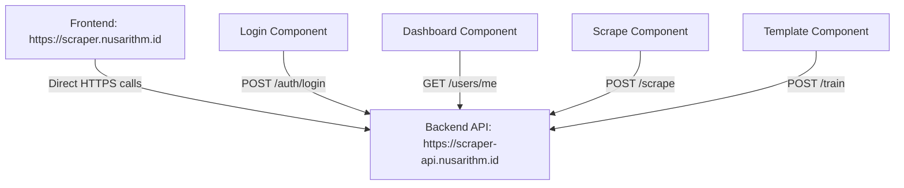

# 🔄 Frontend API Migration - Direct Backend Connection

## 📋 Summary of Changes

Menghilangkan reverse proxy dan mengubah semua API calls di frontend untuk langsung menggunakan URL `https://scraper-api.nusarithm.id/`.

---

## ✅ What Was Changed

### 1. **Created API Configuration Helper**
**File**: `frontend/src/lib/config.ts`
```typescript
export const API_BASE_URL = 'https://scraper-api.nusarithm.id'
export const getApiUrl = (endpoint: string): string => {
  const cleanEndpoint = endpoint.startsWith('/') ? endpoint.slice(1) : endpoint
  return `${API_BASE_URL}/${cleanEndpoint}`
}
```

### 2. **Updated All Components**
Replaced all `/api/backend/*` calls with `getApiUrl()` helper:

#### Components Updated:
- ✅ `ScrapeContent.tsx` - Scraping functionality
- ✅ `CreateTemplate.tsx` - Template creation
- ✅ `URLPreview.tsx` - URL preview
- ✅ `auth/login/page.tsx` - Authentication
- ✅ `auth/register/page.tsx` - User registration
- ✅ `dashboard/page.tsx` - Dashboard functionality
- ✅ `admin/page.tsx` - Admin panel

#### Example Change:
```typescript
// Before
const response = await axios.get('/api/backend/train/templates', { headers })

// After
import { getApiUrl } from '@/lib/config'
const response = await axios.get(getApiUrl('/train/templates'), { headers })
```

### 3. **Removed Next.js Rewrites**
**File**: `frontend/next.config.js`
- Removed complex rewrite logic
- No longer needed since frontend calls backend directly

### 4. **Removed Environment Dependencies**
- No more `NEXT_PUBLIC_BACKEND_URL` environment variable needed
- Simplified configuration

---

## 🌐 New API Architecture



**Before (with reverse proxy):**
```
Frontend → /api/backend/* → Next.js Rewrite → Nginx → Backend
```

**After (direct connection):**
```
Frontend → getApiUrl() → Direct HTTPS → Backend
```

---

## 📁 Files Modified

### Frontend Components
```
frontend/src/lib/config.ts                 # NEW - API configuration
frontend/src/components/ScrapeContent.tsx  # Updated API calls
frontend/src/components/CreateTemplate.tsx # Updated API calls
frontend/src/components/URLPreview.tsx     # Updated API calls
frontend/src/app/auth/login/page.tsx       # Updated API calls
frontend/src/app/auth/register/page.tsx    # Updated API calls
frontend/src/app/dashboard/page.tsx        # Updated API calls
frontend/src/app/admin/page.tsx            # Updated API calls
```

### Configuration Files
```
frontend/next.config.js                    # Removed rewrites
test_api_connection.sh                     # NEW - API testing script
```

---

## 🧪 Testing

### Manual Test Script
```bash
chmod +x test_api_connection.sh
./test_api_connection.sh
```

### Test Endpoints
- **Health**: `https://scraper-api.nusarithm.id/health`
- **API Docs**: `https://scraper-api.nusarithm.id/docs`
- **Info**: `https://scraper-api.nusarithm.id/info`

### Browser Testing
1. Open frontend: `https://scraper.nusarithm.id`
2. Check browser console for API calls
3. Verify all requests go to `https://scraper-api.nusarithm.id`
4. Test login/register functionality
5. Test template creation and scraping

---

## 🔍 Verification Checklist

- [ ] All components import `getApiUrl` from `@/lib/config`
- [ ] No more `/api/backend/*` paths in frontend code
- [ ] All API calls use `getApiUrl('/endpoint')` pattern
- [ ] Browser network tab shows direct calls to `scraper-api.nusarithm.id`
- [ ] CORS headers working properly
- [ ] Authentication flow working
- [ ] Template creation working
- [ ] Scraping functionality working

---

## 🚀 Benefits

### 1. **Simplified Architecture**
- No reverse proxy complexity
- Direct backend communication
- Easier debugging

### 2. **Better Performance**
- Fewer network hops
- No nginx routing overhead
- Direct HTTPS connection

### 3. **Easier Maintenance**
- Single API configuration point
- No environment variable dependencies
- Clearer error handling

### 4. **Better Scalability**
- Backend can be scaled independently
- No nginx configuration changes needed
- Flexible backend deployment

---

## 🛠️ Troubleshooting

### Common Issues

**Issue**: CORS errors
**Solution**: Check backend CORS configuration allows `https://scraper.nusarithm.id`

**Issue**: SSL certificate errors
**Solution**: Ensure `https://scraper-api.nusarithm.id` has valid SSL certificate

**Issue**: API not reachable
**Solution**: Test with `curl https://scraper-api.nusarithm.id/health`

### Debug Commands
```bash
# Test API health
curl https://scraper-api.nusarithm.id/health

# Test with CORS headers
curl -H "Origin: https://scraper.nusarithm.id" -I https://scraper-api.nusarithm.id/health

# Run comprehensive test
./test_api_connection.sh
```

---

## 📈 Migration Complete

✅ **All API calls now use direct backend URL**  
✅ **No reverse proxy dependencies**  
✅ **Simplified configuration**  
✅ **Better performance and maintainability**  

The frontend now directly communicates with the backend API, eliminating the complexity of reverse proxy routing and providing a cleaner, more maintainable architecture.